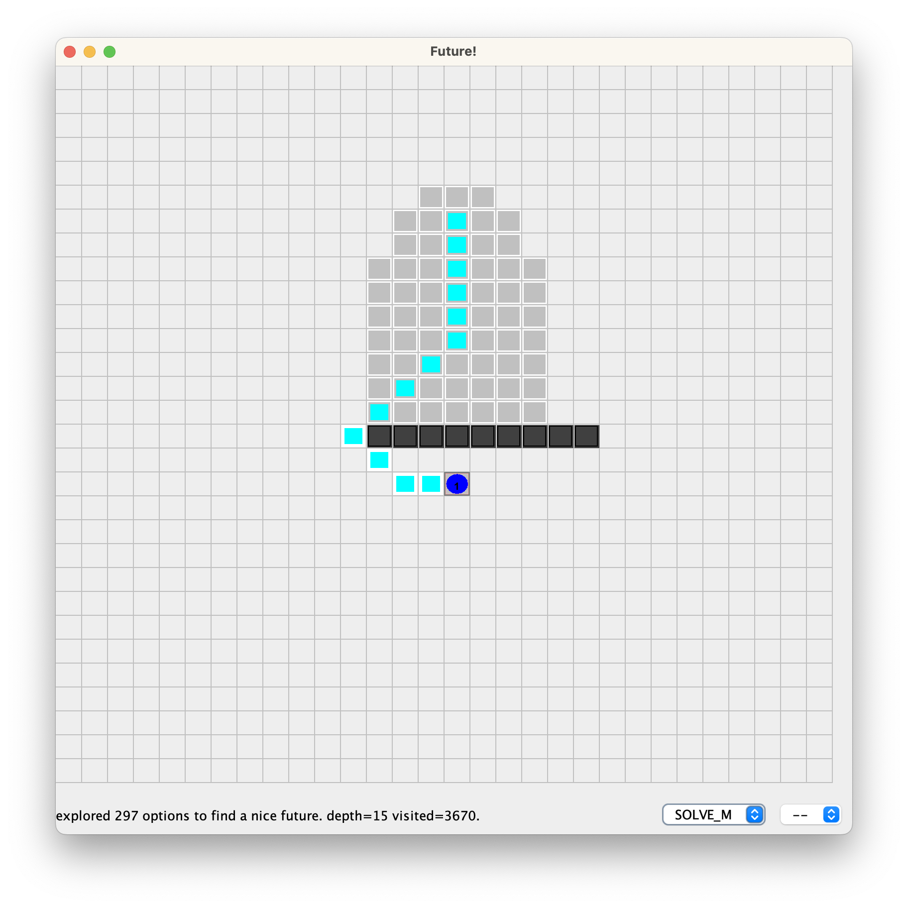
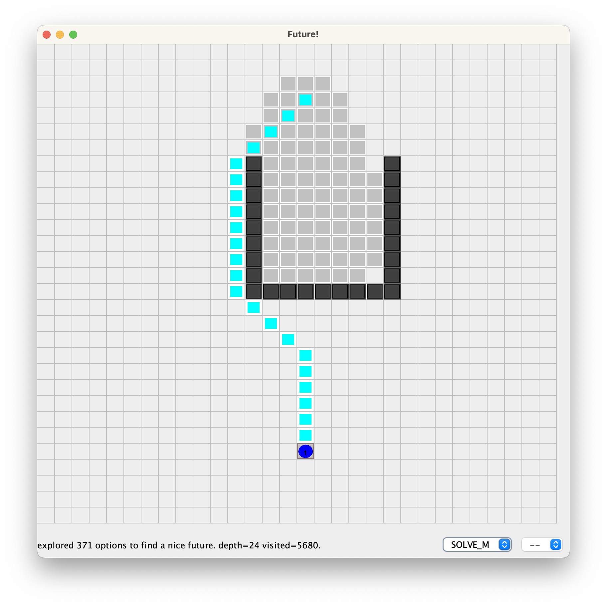
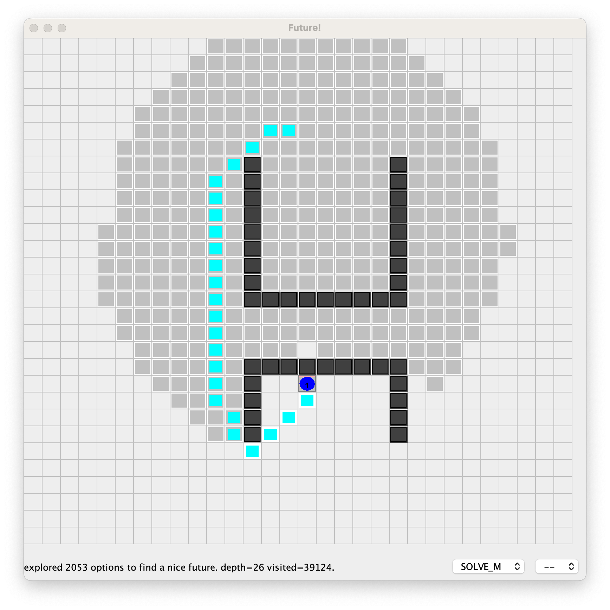
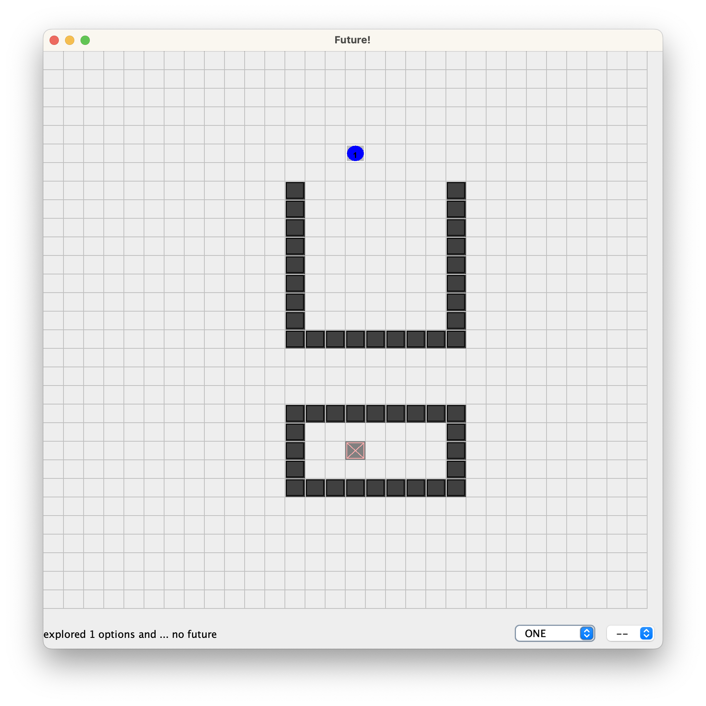
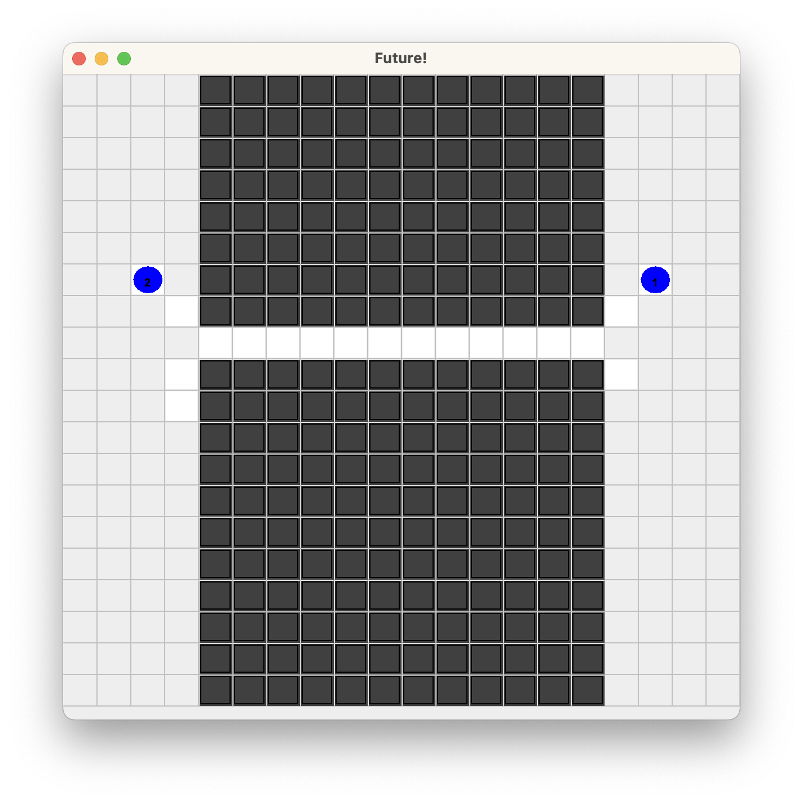
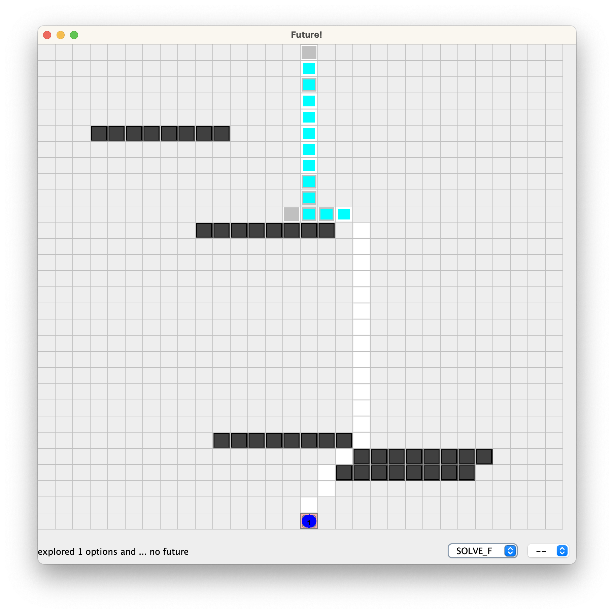
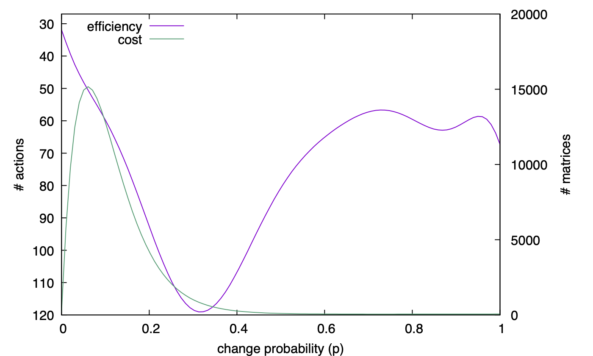

= Results of Future-BDI experiments
:toc: right

== version 1.2 (single agent)

Scenario line:: little "detour".

Scenario U:: good for the agent policy, it needs to anticipate that entering inside the U, which is not a good option.

Scenario H:: bad for the policy

Scenario O:: no solution

[cols="1,1,>1,>1,>1,>1,>1"]
|===
|scenario | strategy | solve | matrices | visited | steps | steps in policy

| line | NONE | no | 0 | &infin; | &infin; | &infin; (100%)
include::stats1.2.txt[]

|===

*Columns*

- matrices: number of explored matrices
- visited: number of states mentally or concretely visited
- steps: steps performed (behavior after reasoning)
- in policy: among the steps, how many follows the policy  preference

*Remarks*:

* ONE: does not solve, as NONE, but does not spend energy for the goal. Discovers it in *linear time*!
* SOLVE_F stays more in policy in all scenarios.
* SOLVE_M stays in policy more than SOLVE_P, with the same number of steps (efficiency).  slower in  some scenarios, faster in  others. middle term strategy (of course)

* scenario line, SOLVE_F is faster, the agent policy works well here.
* scenario U, solve_P is faster, as soon as the bad option is taken, the better
* scenario H, does not add anything significant result. all strategies are equal. policy is not good in this scenario.
* scenario O, ONE is the best strategy in case of no solution in the agent policy.

// [cols="1,1,>1,>1,>1,>1"]
// |===
// |scenario | strategy | #matrices | steps to solution | steps out of polity | steps in policy
//
// |line| SOLVE_P|    419| _15_|  9|  6 (40%)
// |    | SOLVE_M|    217| _15_|  4| 11 (73%)
// |    | SOLVE_F|   _78_|   18|  4| 14 (_77%_)
//
// |U   | SOLVE_P|  _112_| _24_| 20|  4 (_16%_)
// |    | SOLVE_M|    286| _24_| 20|  4 (_16%_)
// |    | SOLVE_F|    374|   28| 24|  4 (14%)
//
// |H   | SOLVE_P|   2006| _26_| 22|  4 (_15%_)
// |    | SOLVE_M|   2028| _26_| 22|  4 (_15%_)
// |    | SOLVE_F|   2001|   28| 24|  4 (14%)
// |===

== version 1.3 (multi-agent)

Scenario:: Crossing bridge.

[cols="1,1,>1,>1,>1,>1,>1"]
|===
|scenario | strategy | solve | matrices | visited | steps | steps in policy

| bridge | NONE | no | 0 | &infin; | &infin; | &infin; (100%)
| bridge | ONE | no | 1 | 25 | -- | 0 (0%)
| bridge | ONE footnote:[agent with recovery plan] | yes | 15 footnote:[the matrix is run 14 times detecting failure in the future, in the 15th execution (when the other agent has crossed) it detects no problem and the agent follows its policy.] | 15 | 15 | 15 (100%)
| bridge | SOLVE_P | yes | 942 | 8333 | 27 | 21 (77%)
|===

*Remarks*:

* SOLVE_P: does 5 times `idle` waiting the other agent to cross. Takes quite a while to compute the solution, more than the other agent takes to cross.
* ONE: together with a recovery plan it is the best strategy for this scenario. recovery plan = if goal fail, do idle and try again.
* MultiAgent version required to _just_ add others in the matrix and options to stay put (`idle` action). Add others in case of Jason is simple: get a usual clone.
* In case of not adding `idle` the agent does some unreasonable moves just to wait the other to cross.

== version 1.5 (dynamic environment)

(see slides with the basics for the dynamic environment xref:../doc/future-bdi-notes-5.pdf[here])

The _environment_ is the same grid as above, but now  walls that can appear and disappear. The agent has to cross the grid, from line 0 to line 29, as shown below.

We *measure*:

- efficiency. We measure the _number of actions_ the agent does to achieve its goal.
- the cost of that efficiency. We considered to measure elapse time, number of created matrices, and number of visited states. All three are very correlated, so _number of matrices_ is used.

We *vary*:

- the environment dynamicity (_p_), from environments that do not change (value 0) to environments that change every cycle (value 1). Changes are implemented by adding or removing walls in the scenario.

- how far the agent looks ahead in the future. It is based on a required certainty (_rc_) of a future state in the matrix (computed by the stochastic properties of the environment). If the agent reaches a state with less than the required certainty, it stops the matrix. If _rc_ = 1, the agent only consider future states that it can be fully sure to be in.

- the agent strategy to find recovery plans when its current policy will bring it to failure. solve_P, solve_M, and solve_F are considered.

It follows the result of an agent using solve_F and _rc_ = 0.9. Average number of walls is 5.

Notes:

- The best efficiency (less actions to achieve the goal) is obtained when the environment is not so dynamic (_p_ < 0.1), since the agent can compute a perfect recovery plan. It pays for that, of course. In this configuration, a lot of matrices were run to find that best plan. *we pay for efficiency*

- With _p_ > 0.5, the agent has not enough certainty about its environment to produce recovery plans and thus few matrices are created. The agent then simply acts randomly since its policy can not be applied and no recovery plan was found. Either the wall blocking it disappear or the random movements will place it in a state where its policy can be applied again, hopefully achieving its goal. *no cost, no gain*

- Around _p_~0.3 we have the worst performance. The agent still can produce recovery plans that deviates from walls. So the agent moves out of its policy to avoid walls, but they will likely disappear. To deviate was thus unnecessary steps. The expensive recovery plan might be useless in the future where the considered walls will not be there anymore or others are added. *waist of energy (computational and actions) for an uncertainty environment*

- Conclusion, Jason(F) for recovery is useful until _p_ < 0.1, after that, it is better to select actions randomly when the policy has no future.

