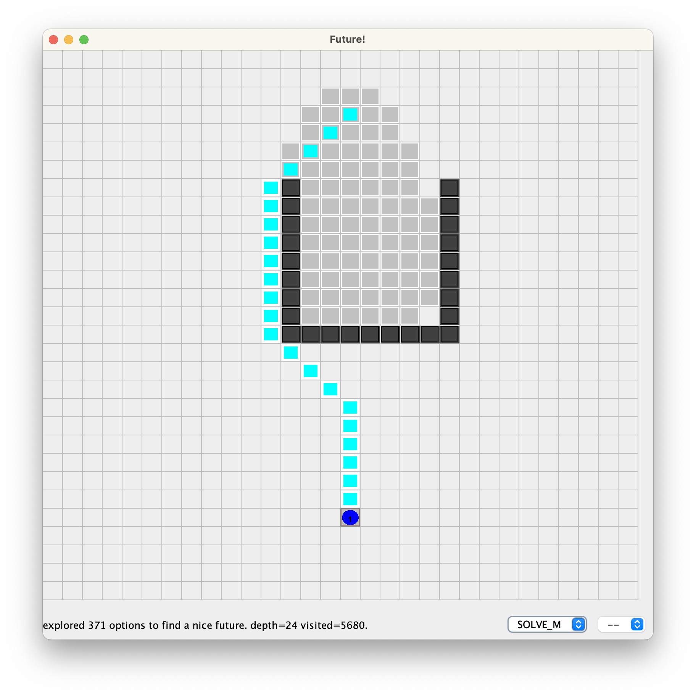
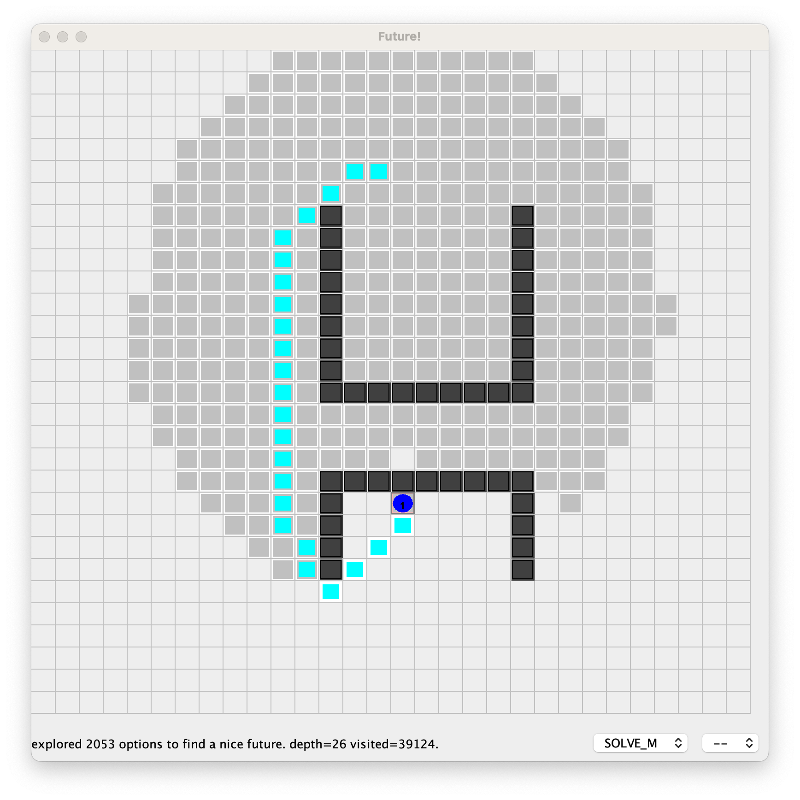
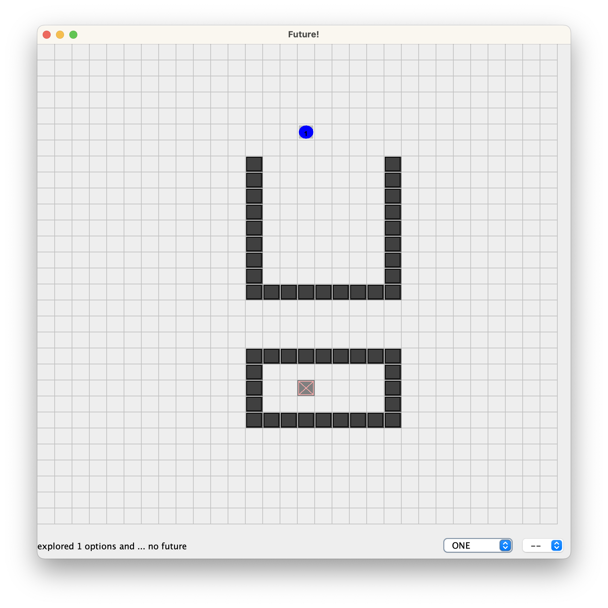

= Results of Future-BDI experiments -- v1.1

Scenario line:: little "detour".

image:screens1.1/line-m.png[]

Scenario U:: good for the agent policy, it needs to anticipate that entering inside the U, which is not a good option.

Scenario H:: bad for the policy

Scenario O:: no solution

== Results

[cols="1,1,>1,>1,>1,>1,>1"]
|===
|scenario | strategy | solve | matrices | visited | steps | steps in policy

| line | NONE | no | 0 | &infin; | &infin; | &infin; (100%)
| line | ONE | no | 1 | 12 | -- | 0 (0%)
| line | SOLVE_P | yes | 477 | 5993 | 15 | 6 (40%)
| line | SOLVE_M | yes | 297 | 3670 | 15 | 11 (73%)
| line | SOLVE_F | yes | 81 | 1134 | 18 | 15 (83%)
| U | ONE | no | 1 | 15 | -- | 0 (0%)
| U | SOLVE_P | yes | 230 | 3509 | 24 | 20 (83%)
| U | SOLVE_M | yes | 371 | 5680 | 24 | 20 (83%)
| U | SOLVE_F | yes | 379 | 6317 | 28 | 24 (85%)
| H | ONE | no | 1 | 12 | -- | 0 (0%)
| H | SOLVE_P | yes | 2058 | 39229 | 26 | 5 (19%)
| H | SOLVE_M | yes | 2053 | 39124 | 26 | 5 (19%)
| H | SOLVE_F | yes | 2036 | 40849 | 27 | 6 (22%)
| O | ONE | no | 1 | 12 | -- | 0 (0%)
| O | SOLVE_P | no | 5238 | 131472 | -- | 0 (0%)
| O | SOLVE_M | no | 5239 | 131504 | -- | 0 (0%)
| O | SOLVE_F | no | 5254 | 137850 | -- | 0 (0%)

|===

*Columns*

- matrices: number of explored matrices
- visited: number of states mentally or concretely visited
- steps: steps performed (behavior after reasoning)
- in policy: among the steps, how many follows the policy  preference

*Remarks*:

* ONE: does not solve, as NONE, but does not spend energy for the goal. Discovers it in *linear time*!
* SOLVE_F stays more in policy in all scenarios.
* SOLVE_M stays in policy more than SOLVE_P, with the same number of steps (efficiency).  slower in  some scenarios, faster in  others. middle term strategy (of course)

* scenario line, SOLVE_F is faster, the agent policy works well here.
* scenario U, solve_P is faster, as soon as the bad option is taken, the better
* scenario H, does not add anything significant result. all strategies are equal. policy is not good in this scenario.
* scenario O, ONE is the best strategy in case of no solution in the agent policy.

// [cols="1,1,>1,>1,>1,>1"]
// |===
// |scenario | strategy | #matrices | steps to solution | steps out of polity | steps in policy
//
// |line| SOLVE_P|    419| _15_|  9|  6 (40%)
// |    | SOLVE_M|    217| _15_|  4| 11 (73%)
// |    | SOLVE_F|   _78_|   18|  4| 14 (_77%_)
//
// |U   | SOLVE_P|  _112_| _24_| 20|  4 (_16%_)
// |    | SOLVE_M|    286| _24_| 20|  4 (_16%_)
// |    | SOLVE_F|    374|   28| 24|  4 (14%)
//
// |H   | SOLVE_P|   2006| _26_| 22|  4 (_15%_)
// |    | SOLVE_M|   2028| _26_| 22|  4 (_15%_)
// |    | SOLVE_F|   2001|   28| 24|  4 (14%)
// |===

