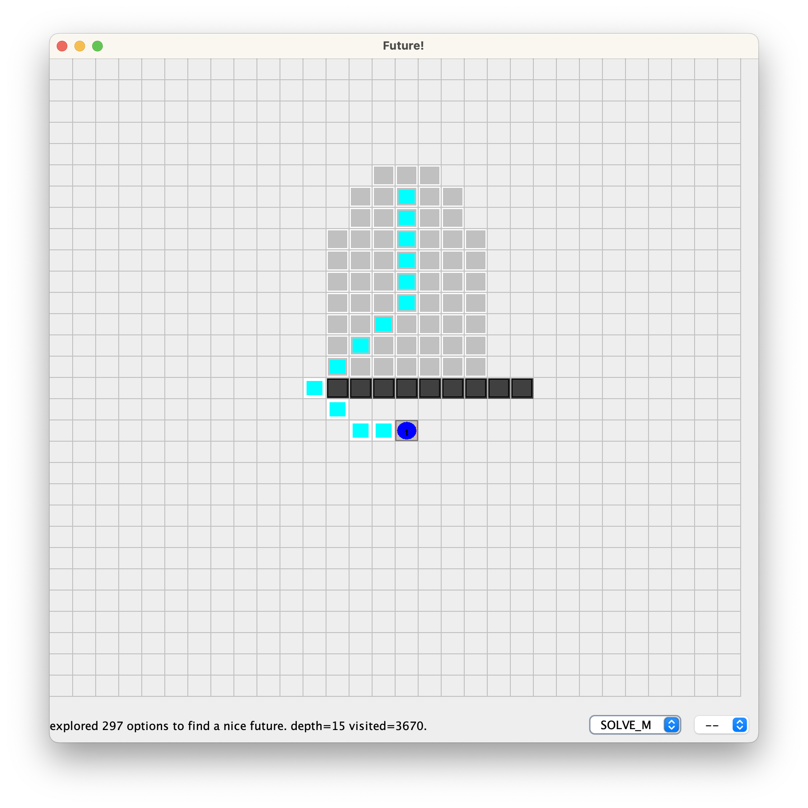
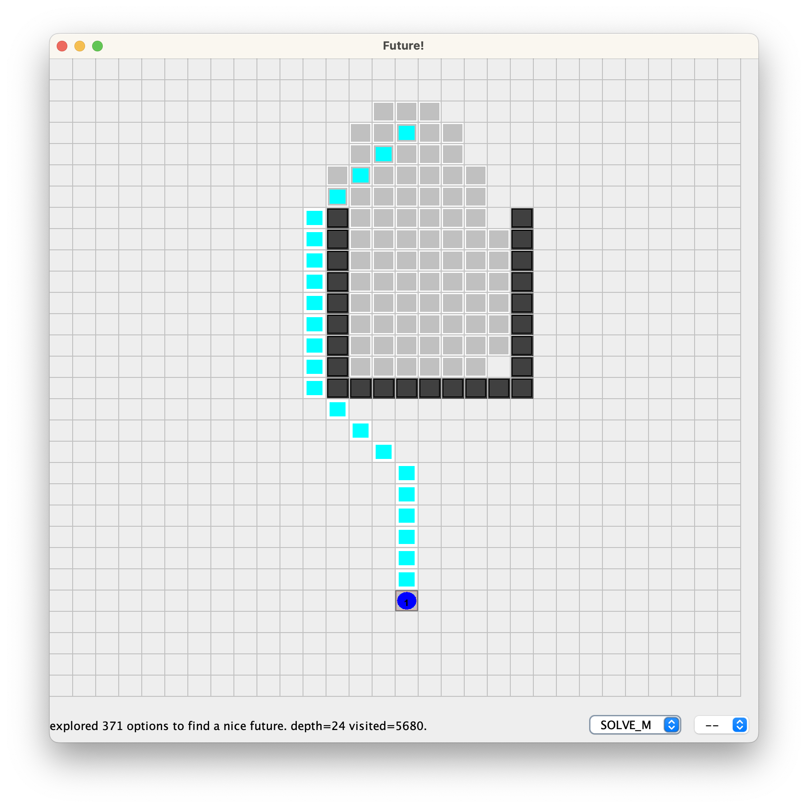

= Results of Future-BDI experiments -- Single Agent, v1.2

Scenario line:: little "detour".

Scenario U:: good for the agent policy, it needs to anticipate that entering inside the U, which is not a good option.

Scenario H:: bad for the policy

image:../v1.1/screens1.1/h-m.png[]

Scenario O:: no solution

image:../v1.1/screens1.1/o-o.png[]

== Results

[cols="1,1,>1,>1,>1,>1,>1"]
|===
|scenario | strategy | solve | matrices | visited | steps | steps in policy

| line | NONE | no | 0 | &infin; | &infin; | &infin; (100%)
| line | ONE | no | 1 | 11 | -- | 0 (0%)
| line | SOLVE_P | yes | 477 | 5516 | 14 | 6 (42%)
| line | SOLVE_M | yes | 297 | 3373 | 14 | 11 (78%)
| line | SOLVE_F | yes | 81 | 1053 | 17 | 15 (88%)
| U | ONE | no | 1 | 14 | -- | 0 (0%)
| U | SOLVE_P | yes | 230 | 3279 | 23 | 20 (86%)
| U | SOLVE_M | yes | 371 | 5309 | 23 | 20 (86%)
| U | SOLVE_F | yes | 379 | 5938 | 27 | 24 (88%)
| H | ONE | no | 1 | 11 | -- | 0 (0%)
| H | SOLVE_P | yes | 2058 | 37171 | 25 | 5 (20%)
| H | SOLVE_M | yes | 2053 | 37071 | 25 | 5 (20%)
| H | SOLVE_F | yes | 2036 | 38813 | 26 | 6 (23%)
| O | ONE | no | 1 | 11 | -- | 0 (0%)
| O | SOLVE_P | no | 5238 | 126234 | -- | 0 (0%)
| O | SOLVE_M | no | 5239 | 126265 | -- | 0 (0%)
| O | SOLVE_F | no | 5254 | 132596 | -- | 0 (0%)

|===

*Columns*

- matrices: number of explored matrices
- visited: number of states mentally or concretely visited
- steps: steps performed (behavior after reasoning)
- in policy: among the steps, how many follows the policy  preference

*Remarks*:

* ONE: does not solve, as NONE, but does not spend energy for the goal. Discovers it in *linear time*!
* SOLVE_F stays more in policy in all scenarios.
* SOLVE_M stays in policy more than SOLVE_P, with the same number of steps (efficiency).  slower in  some scenarios, faster in  others. middle term strategy (of course)

* scenario line, SOLVE_F is faster, the agent policy works well here.
* scenario U, solve_P is faster, as soon as the bad option is taken, the better
* scenario H, does not add anything significant result. all strategies are equal. policy is not good in this scenario.
* scenario O, ONE is the best strategy in case of no solution in the agent policy.

