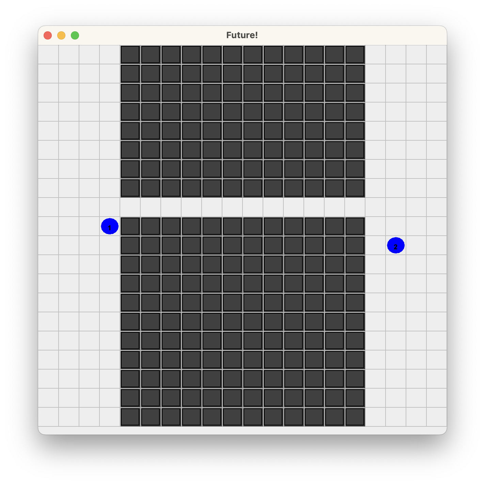

= Results of Future-BDI experiments -- Multi-Agent, v1.3

Scenario:: Crossing bridge.

[cols="1,1,>1,>1,>1,>1,>1"]
|===
|scenario | strategy | solve | matrices | visited | steps | steps in policy

| bridge | NONE | no | 0 | -- | &infin; | &infin; (100%)
| bridge | ONE  | no | 1 | 25 | 0 | 0 (0%)
| bridge | ONE footnote:[agent with recovery plan] | yes | 15 footnote:[the matrix is run 14 times detecting failure in the future, in the 15th execution (when the other agent has crossed) it detects no problem and the agent follows its policy.] | 15 | 15 | 15 (100%)
| bridge | SOLVE_P | yes | 942 | 8333 | 27 | 21 (77%)
|===

*Remarks*:

* SOLVE_P: does 5 times `idle` waiting the other agent to cross. Takes quite a while to compute the solution, more than the other agent takes to cross.
* ONE: together with a recovery plan it is the best strategy for this scenario. recovery plan = if goal fail, do idle and try again.
* MultiAgent version required to _just_ add others in the matrix and options to stay put (`idle` action). Add others in case of Jason is simple: get a usual clone.
* In case of not adding `idle` the agent does some unreasonable moves just to wait the other to cross.

