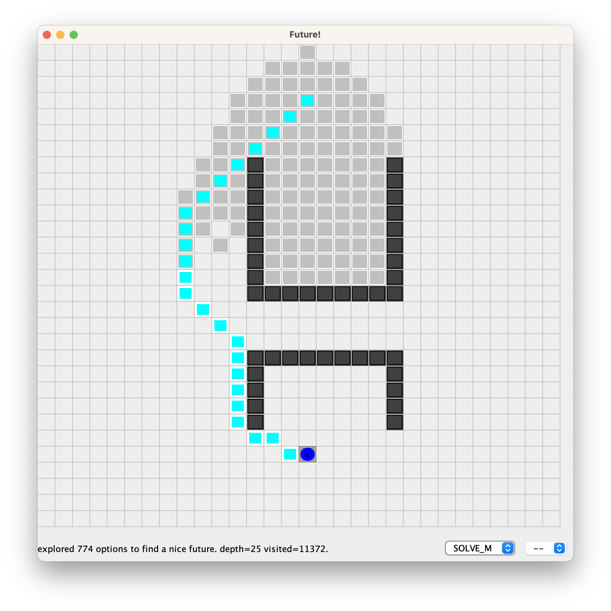

= Results of Future-BDI experiments -- Single Agent, Grid Scenario, v1.4

Scenario line:: little "detour".

Scenario U:: good for the agent policy, it needs to anticipate that entering inside the U, which is not a good option.

Scenario H:: bad for the policy. H2 does not consider actions to north.

== Results

[cols="1,1,>1,>1,>1,>1,>1"]
|===
|scenario | strategy | solve | matrices | visited | actions | steps in policy

| line | NONE | no | 0 | &infin; | &infin; | &infin; (100%)
| line | ONE | no | 1 | 10 | -- | 0 (0%)
| line | SOLVE_P | yes | 732 | 8414 | 15 | 8 (53%)
| line | SOLVE_M | yes | 565 | 6415 | 15 | 11 (73%)
| line | SOLVE_F | yes | 196 | 2578 | 19 | 16 (84%)
| U | SOLVE_P | yes | 241 | 3489 | 23 | 20 (86%)
| U | SOLVE_M | yes | 418 | 6032 | 23 | 20 (86%)
| U | SOLVE_F | yes | 435 | 6890 | 26 | 23 (88%)
| H | SOLVE_P | yes | 826 | 12353 | 25 | 14 (56%)
| H | SOLVE_M | yes | 774 | 11372 | 25 | 14 (56%)
| H | SOLVE_F | yes | 677 | 11053 | 28 | 17 (60%)

| H2 | SOLVE_P | yes | 513 | 7869 | 25 | 14 (56%)
| H2 | SOLVE_M | yes | 488 | 7353 | 25 | 14 (56%)
| H2 | SOLVE_F | yes | 440 | 7132 | 27 | 16 (59%)

|===

*Columns*

- matrices: number of explored matrices
- visited: number of states mentally or concretely visited
- path: distance of the path to destination
- in policy: among the steps, how many follows the policy  preference

*Remarks*:

* ONE: does not solve, as NONE, but does not spend energy for the goal. Discovers it in *linear time*!
* SOLVE_F stays more in policy in all scenarios.
* SOLVE_M stays in policy more than SOLVE_P, with the same number of actions (efficiency).  slower in  some scenarios, faster in  others. middle term strategy (of course)

* scenario line, SOLVE_F is faster, the agent policy works well here.
* scenario U, solve_P is faster, as soon as an alternative option is taken, the better
* scenario H, does not add anything significant in the results. all strategies are equal. policy is not good in this scenario.
* scenario O, ONE is the best strategy in case of no solution in the agent policy.

