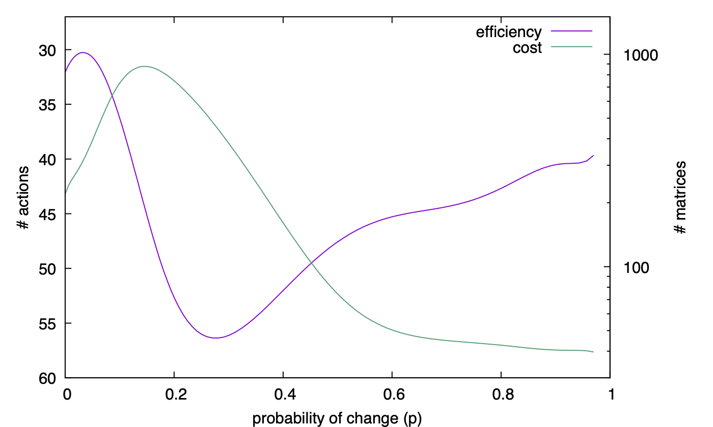

= Results of Future-BDI experiments -- Dynamic Environment, v1.5

(see slides with the basics for the dynamic environment xref:../../doc/future-bdi-notes-5.pdf[here])

The _environment_ is the same grid as above, but now  walls that can appear and disappear. The agent has to cross the grid, from line 0 to line 29, as shown below.

image:figs/d-env.png[]

We *measure*:

- efficiency. We measure the _number of actions_ the agent does to achieve its goal.
- the cost of that efficiency. We considered to measure elapse time, number of created matrices, and number of visited states. All three are very correlated, so _number of matrices_ is used.

We *vary*:

- the environment dynamicity (_p_), from environments that do not change (_p_=0) to environments that change every cycle (_p_=1). Changes are implemented by adding or removing walls in the scenario.

- how far the agent looks ahead in the future. It is based on a required certainty (_rc_) of a future state in the matrix (computed by the stochastic properties of the environment). If the agent reaches a state with less than the required certainty, it stops the matrix. For instance, if _rc_=1, the agent only considers future states that it can be fully sure to be in. If _rc_=0, the agent does not care about certainty.

- the agent strategy (_s_) to find recovery plans when its current policy will bring it to failure. solve_P, solve_M, and solve_F are considered.

*Terminology*:

- _episode_ starts with the agent at (15,0) and ends when it arrives at (15,29).

- _configuration_ : a combination of _p_, _rc_, _s_  used in the execution of an episode.

== Results

It follows the result of an agent using solve_F and _rc_ = 0.9. Number of walls is 5. 1031 episodes. Executions with more than 5000 matrices are aborted.

Notes:

- The best efficiency (less actions to achieve the goal) is obtained when the environment is not so dynamic (_p_ < 0.1), since the agent can compute a good recovery plan that remains good during the episode. It pays for that, of course. In this configuration, a lot of matrices were run to find that best plan. *we pay for efficiency*

- With _p_ > 0.5, the agent has not enough certainty about its environment to produce recovery plans and thus few matrices are created (low cost). When its policy can not be applied and no recovery plans can be built, the agent simply acts randomly. In case it gets stuck, either the wall blocking it disappear or the random movements will place it in a state where its policy can be applied again, hopefully achieving its goal. *no cost, no gain*, *random scenario -> random strategy*

- Around _p_~0.3 we have the worst performance, both in terms of efficiency and cost. The agent still can produce recovery plans that deviates from walls. So the agent moves out of its policy to avoid walls, but they will likely disappear (specially walls that are far from the agent). To deviate produces unnecessary steps (thus the low efficiency). The expensive recovery plan might be useless in the future where the considered walls will not be there anymore or others are added. *waist of energy (computational and actions) for an uncertainty environment*

- With _p_=0 we do not have the best efficiency! The reason is the solve_f strategy, that tries deviate less from the agent policy (that is not optimal in these experiments).

- [Still thinking about the reasons for the best efficiency being related to small _p_ (!!!)]

- Conclusion, in configurations (., 0.9, solve_f), it is useful to build recovery plans until _p_ < 0.1 (less than 35 actions), after that, it is better to select actions randomly when the policy has no future (around 43 actions).

