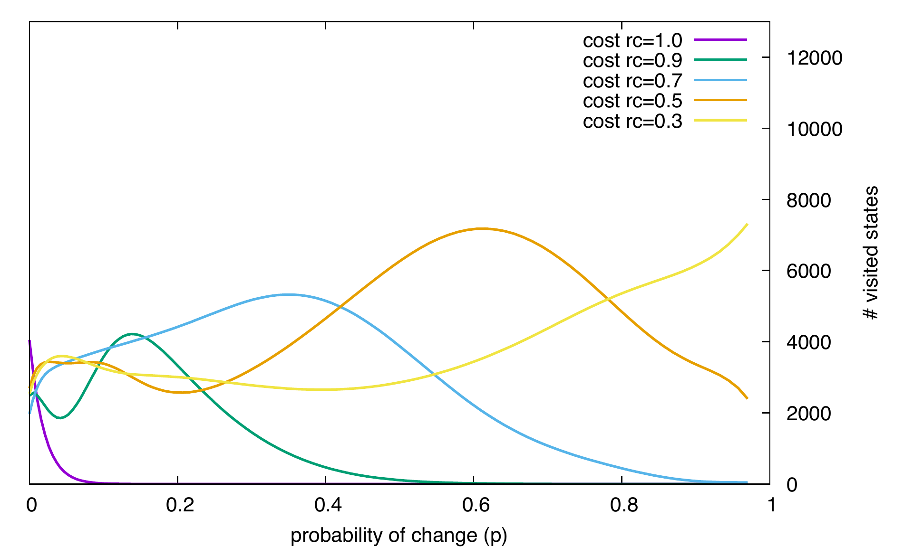

= Results of Future-BDI experiments -- Dynamic Environment, v1.5

(see slides with the basics for the dynamic environment xref:../../doc/future-bdi-notes-5.pdf[here])

The _environment_ is the same grid as in previous versions, but now  walls can appear and disappear. The agent has to cross the grid, from line 0 to line 19, as shown below.

image:figs/d-env.png[]

The agent *behaviour* is:

1. Perceive the environment and select a plan based on its policy (a plan implies an action). The policy is: select a plan with a valid action that brings the agent near its destination.
2. Use the matrix to compute the future; if ok, proceed with the selected plan.
3. If not ok, use a recovery strategy to search for an alternative plan (the recovery plan). Then use the action of this plan. [assuming that _recovery plan_ was explained somewhere else, it may be another option now or in the future.]
4. Go to step 1.

We *measure*:

- effectiveness. We measure whether the agent _successfully_ cross the grid before a timeout;
- efficiency. We measure the _number of actions_ the agent does to achieve its goal; and
- the cost of that efficiency. We considered to measure elapse time, number of created matrices, and number of visited states. All three are very correlated, so the number of _visited states_ is used.

We *vary*:

- the environment dynamicity (_p_), from environments that do not change (_p_=0) to environments that change every cycle (_p_=1). Changes are implemented by adding or removing walls in the scenario.

- how far the agent looks ahead in the future. It is based on a required certainty (_rc_) of a future state of the matrix (computed from the stochastic properties of the environment). If the matrix reaches a state with less than the required certainty, the agent stops the matrix. For instance, if _rc_=1, the agent only considers future states that it can be fully sure about. If _rc_=0, the agent does not care about certainty.

- the agent recovery strategy (_s_) while searching for a recovery plan when its current policy select plans that bring it to a failure. _s_ = solve_P (other options now), solve_M, solve_F (other options latter), or random. Random strategy consists of selecting a random valid plan in place of the selected plan.

*Terminology*:

- an _episode_ starts with the agent at (15,0) and ends when either it arrives at (15,19) or the deadline is reached.

- _configuration_ : a combination of _p_, _rc_, _s_  used in the execution of an episode.

- environment _cycle_ starts with an environment state, the agent executes an action, and we have the next state (for the next cycle).

== Results

It follows the result of an agent using _s_ = solve_M and _rc_ = 0.9, _p_ varies from 0 to 1 (x-axis). Number of walls is 5. 895 episodes. Executions that took more than 10 seconds were aborted and the agent goal is considered not achieved. (to read the effectiveness in the graph, the y line for 100000 visited states corresponds to the fact that the agent is effective 100% of the executions.)

The objective is to evaluate _rc_ in the search for recovery plans. (it is not the use of matrix to detect future failures.)

Notes:

- The best efficiency (less actions to achieve the goal) is obtained when the environment is not so dynamic (_p_ < 0.1), since the agent can find a good recovery plan that remains good during the episode. It pays for that, of course. In this configuration, a several states are visited in the search for that recovery plan. *we pay for efficiency*. That cost may be so high that the agent misses the deadline (not effective).

- With _p_ > 0.5, the agent has not enough certainty about the future of its environment to properly search for recovery plans and thus few states are visited (low cost). When its policy can not be applied (the selected plan leads to a bad future) and no recovery plans can be found (for lack of certainty), the agent simply acts randomly. In case it gets stuck, either the wall blocking it disappear or the random movements will place it in a state where its policy can be applied again, hopefully achieving its goal (so the high effectiveness of this case). *no cost, no gain*, *random scenario -> random strategy*

- Around _p_~0.2 we have the worst performance in terms of efficiency and cost, also not great in terms of effectiveness. Given this dynamicity, the agent can still dedicate time in the search for recovery plans. Using these plans, the agent moves out of its policy to avoid walls, but these walls will likely disappear (specially walls that are far from the agent). To deviate produces unnecessary steps (thus the low efficiency). The recovery plans (expensive to find) might be inefficient in the future when the walls may not be there anymore or others are added. *waist of energy (computational and actions) for an uncertainty environment*

- Around _p_~0.1 we have only 30% of success in crossing the grid! Although the random strategy could be used, since it is always effective, the efficiency is also quite bad. For now, this kind of environment is quite a challenge. (latter we will discover that other values of _rc_ can do better in this environment.)

- The efficiency of the random strategy gets better as the environment becomes more dynamic. With _p_ > 0.3, its efficiency is almost the same as solve_M. Notice that there is no cost in this strategy.

//- With _p_=0 we do not have the best efficiency! The reason is the solve_f strategy, that avoids to deviate from the agent policy (that is not optimal in these experiments). When _p_ increases a bit, recovery plans tend to select more efficient plans.

- For _rc_~0.9, better results can be achieved in an environment that is either more static or highly dynamic. It is particularly difficult to be effective/efficient/cheap in environment with _p_ ~ 0.2. (this _p_ value changes as we change _rc_ as seen in the next Section.)

- Conclusion, in configurations (., 0.9, solve_M), it is useful to search for recovery plans until _p_ < 0.2, after that, it is better to select actions randomly when the policy has no future.

== Choosing _rc_

It follows the result of an agent using _s_ = solve_M. The environment dynamicity (_p_) varies from 0 to 1 (x-axis). Number of walls is 5. 4737 episodes. Executions that took more than 10 seconds were aborted and the agent goal is considered not achieved.

The objective is to evaluate different required certainties (_rc_) on different environments, with different dynamicity (_p_).

The following graph shows how effective is the agent for different _rc_, measured by percentage of executions where the agent has crossed the grid before 10 seconds. *As _rc_ decreases, the overall effectiveness decreases*. [overall means for all _p_; the area above each line.]

image:graphs/solve-m-a-success.pdf.png[]

The following graph shows the behaviour of efficiency, measured by the mean of the number of actions used to cross the grid. *As _rc_ decreases, the overall efficiency increases*.

image:graphs/solve-m-a-eff.pdf.png[]

The following graph shows the behaviour of cost, measure by the mean of the number of states visited to select recovery choices. *As _rc_ decreases, the overall cost increases*.

Notes about choosing _rc_

- low dynamic environment (_p_ ~ 0.1):

* if effectiveness is an issue, _rc_ =< 0.5 is preferred. _p_=1 is also effective, but its efficiency is quite bad.

* if efficiency is an issue, _rc_ < 0.9 is preferred.

* if cost is an issue, all values of _rc_ are ok. _p_ ~ 1.0 has better cost, but it performs quite bad in the other criteria.

* _rc_ ~ 0.5 seems the general best option.

- medium dynamic environment (_p_ ~ 0.5)

* if effectiveness is an issue, _rc_ >= 0.9 should be chosen.

* if efficiency is an issue, _rc_ =< 0.7 is preferred. Although the differences may be not relevant for some applications.

* if cost is an issue, 0.5 =< _rc_ =< 0.7 has worst cost

* _rc_ ~ 0.9 seems the general best option.

- high dynamic environment (_p_ ~ 0.9):

* regarding effectiveness, _rc_ >= 0.5 should be chosen.

* regarding efficiency, all values have similar results.

* regarding cost, _rc_ >= 0.7 should be chosen.

* _rc_ ~ 1.0 seems the general best option. Notice that with _rc_=1 and _p_=1, we have the same case of the random strategy, since no matrix can run in that configuration.

* in general, the random strategy seems a general best option.

- as _p_ increases, the _rc_ worst case also increases.

- _rc_ =< 0.3 is not a good option for any cases. Although the efficiency is quite good, the few times the agent succeed to cross the grid, it did it quite fast, this result is unlikely (see effectiveness).
