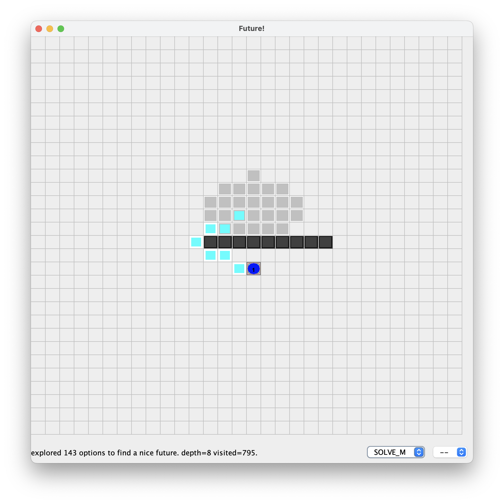
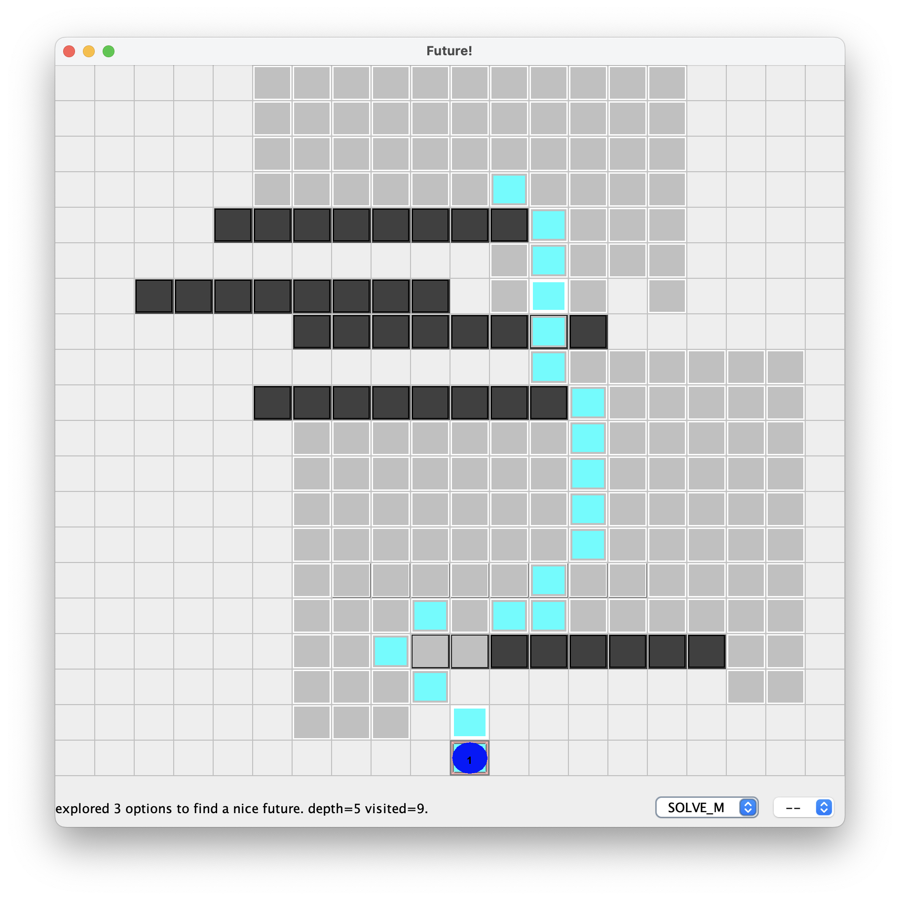
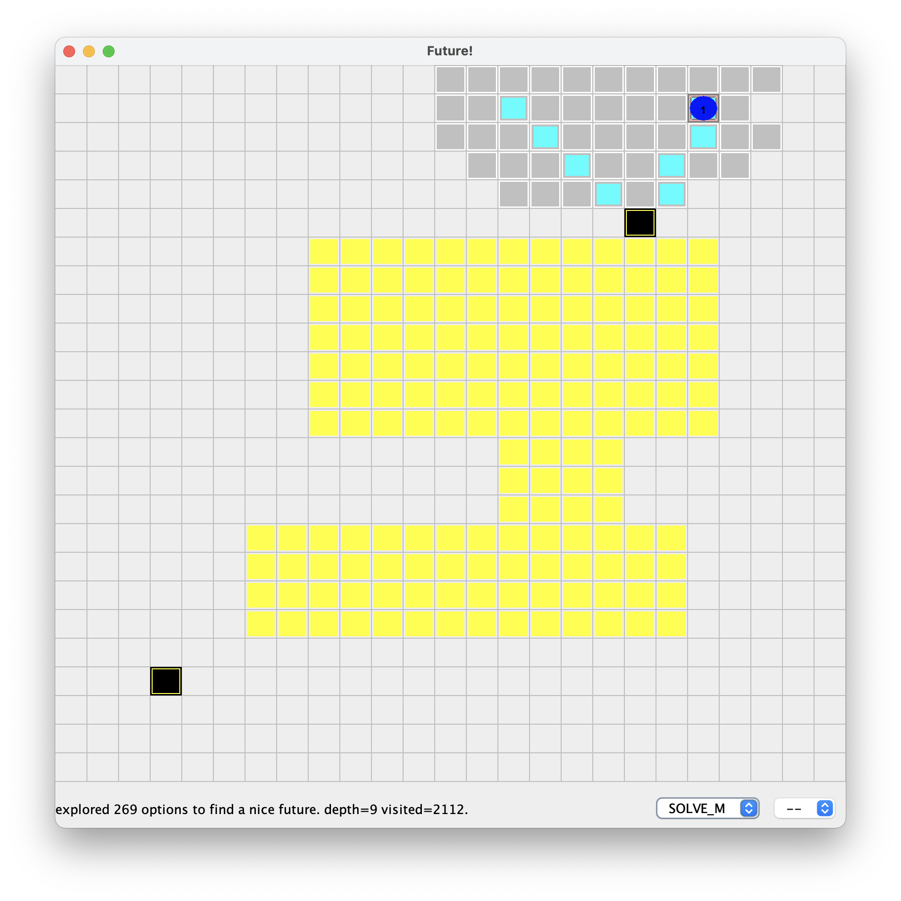
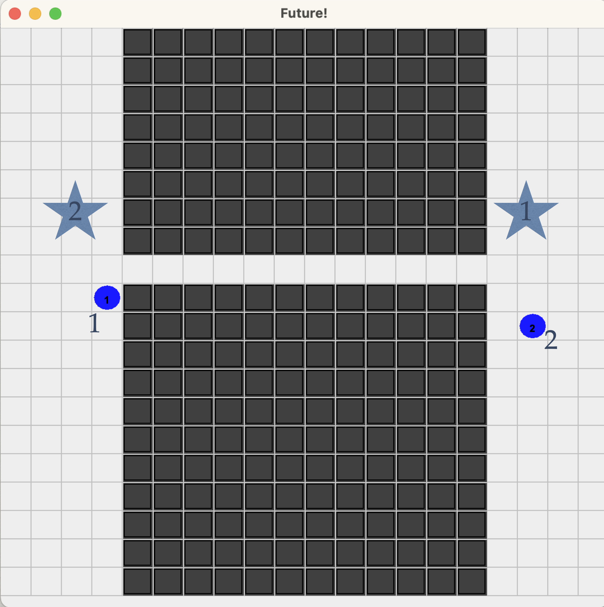

= Jason(F)

This projects adds to https://jason-lang.github.io[Jason] agents some capability to reason about the future. See doc folder for more details.

Publications: 

 - Jomi Fred Hübner, Samuele Burattini, Alessandro Ricci, and Simon Mayer. Reflexive anticipatory reasoning by BDI agents. Auton. Agents Multi Agent Syst., 39(1):7, 2025. https://doi.org/10.1007/s10458-025-09687-8.

 - Jomi Hübner, Samuele Burattini, Alessandro Ricci, and Simon Mayer. Anticipatory thinking in multi-agent contexts. In Anais do XIX Workshop-Escola de Sistemas de Agentes, seus Ambientes e Aplicações, Brasil, 2025. SBC. (best paper).
 http://dx.doi.org/10.5753/wesaac.2025.37525.

== Grid Example

In the first scenario of the grid, the agent discovers that its usual plan selection will not achieve the goal. It then searches for alternative options and finds a way to achieve the goal.

In the interface, you can select other target goals and scenarios. To run:

----
./gradlew :examples:run --args="grid2.mas2j"
----

In the second scenario, the environment is dynamic: new walls appear and disappear dynamically.

----
./gradlew :examples:run --args="grid3.mas2j"
----

In the third scenario, the agent selects options to avoid to violate *norms*. The norms are defined in xref:examples/src/org/norms.npl[this file] using https://github.com/moise-lang/npl[NPL] (Normative Programing Language). There are two norms:

- the agent should not enter the limited traffic zone (in yellow in the picture). A norm of type prohibition.

- if there is a "portal" near the target, the agent should pass through it (black squares in the picture). A norm of type obligation.

The beauty of this example is that we can change the norms to change the agent behaviour, no need to reprogram the agent!

To run:

----
./gradlew :examples:run --args="grid-norms1.mas2j"
----

== Bridge Example

This scenario illustrate two agents acting on the same environment. Both want to cross a river using a bridge that is narrow so that only one agent can pass. One agent reason about the future, the other is "normal". It foresees that they will be blocked in the middle of the bridge and waits for the second to cross, then it crosses the bridge.

To run:
----
./gradlew :examples:run --args="bridge2.mas2j"
----

